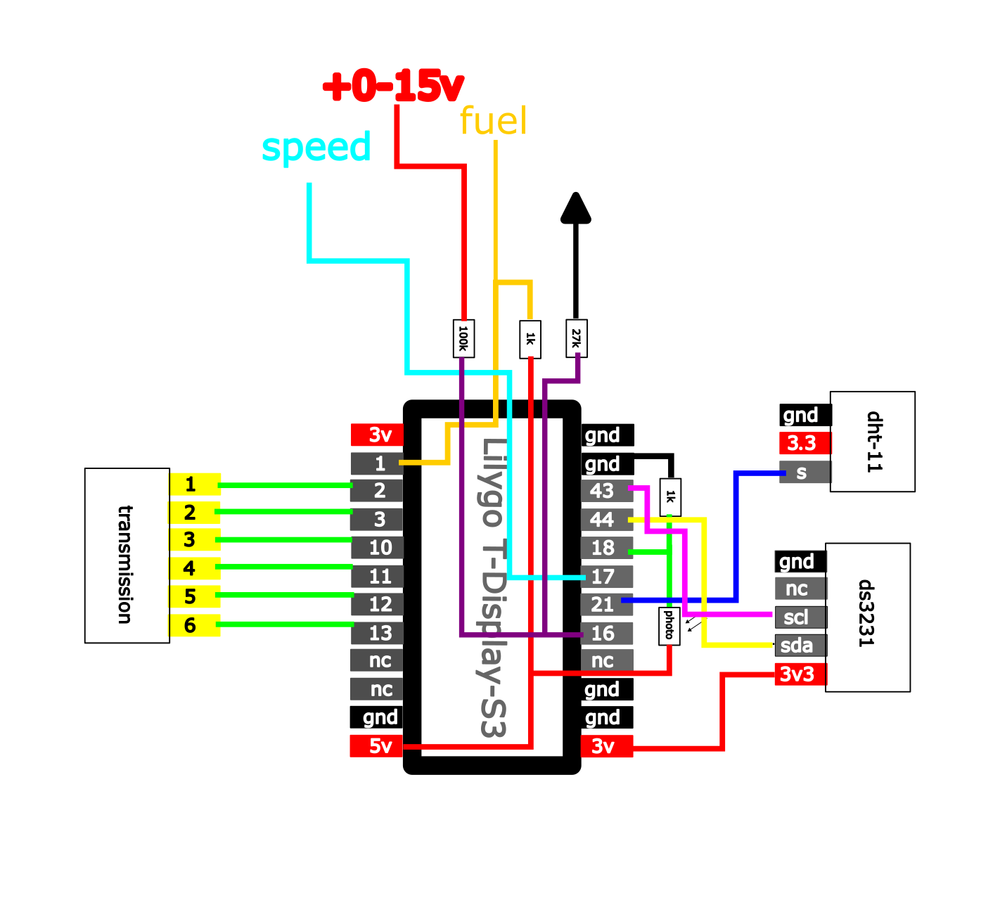

# Onboard Computer Project

This repository contains the firmware and configuration for a custom onboard computer built on ESP32-S3 running MicroPython.  
It is based on the LilyGo T-Display-S3 board with an ST7789 display (170x320).

## Features
- Custom firmware for ESP32-S3  
- ST7789 display driver configuration  
- Fuel level measurement  
- Calculation of remaining fuel in the tank for the remaining distance (values are approximate and not exact, as they depend on the fuel level sensor in the tank, and the accuracy of the readings depends on the precision of the fuel sensor resistance)  
- Vehicle network voltage monitoring  
- Air temperature and humidity  
- Daily mileage tracking  
- Real-time clock  
- Gear indicator  
- Automatic backlight adjustment depending on ambient light  
- Modular code structure for easy extension  

## Authors
- **Ruslan Tursunov (2025)** – main developer of this onboard computer project  
- **Russ Hughes (2020–2022)** – author of the `s3lcd` library and display configuration examples  
- **Ivan Belokobylskiy (2019)** – original author of the configuration code incorporated into `s3lcd`  

## License
This project is licensed under the [MIT License](LICENSE).  
All original copyright notices have been preserved.

## Firmware Installation
First, install [Python](https://www.python.org/).
- Use a virtual environment to install the tools:

```
python3 -m venv .venv
source .venv/bin/activate
```
- Install esptool:
```
pip install esptool
```
- Check which port the microcontroller is connected to:
```
ls /dev/cu.*
```
Example output:
```
/dev/cu.usbmodem1101
```
- Flash the firmware using esptool:
```
esptool.py --port /dev/tty.<your_com_port> erase_flash
esptool.py --chip ESP32-S3 --port /dev/tty.<your_com_port> write_flash -z 0x1000 firmware/firmware.bin
```
- Upload the contents of the [main](main) folder to the microcontroller’s memory.

## Configure Parameters
Parameters:
- Wheel size for speed and fuel range calculation  
- Full tank volume  
- Highway fuel consumption  
- City fuel consumption  

These values are set in the corresponding variables in [handlers.py](main/functions/handlers.py).

## Components
- LilyGo T-Display-S3  
- DS3231  
- DHT11  
- 1kΩ resistor ×2  
- 100kΩ resistor  
- 27kΩ resistor  
- Photoresistor  
- Step-down power module (12–15V to 5V)  

## Wiring Diagram


## Target Application
This project was developed for the CFMOTO TK650 motorcycle.  
At the moment, it has not yet been installed or tested.

## Acknowledgments
Special thanks to:
- **[Russ Hughes](https://github.com/russhughes)** for his excellent [s3lcd](https://github.com/russhughes/s3lcd) library, which provided the foundation for display handling.  
- **[Ivan Belokobylskiy](https://github.com/devbis)** for the original configuration work that made ESP32 display drivers more accessible.  

Without their contributions, this project would not have been possible.